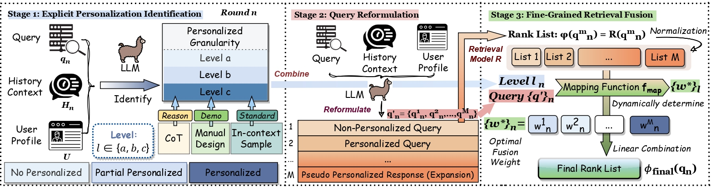

<p align="center">
  
</p>

# 🤖PPCIR: Precise Personalized Conversational IR via Fine-Grained Fusion 
<p>
<a href="https://github.com/DaoD/INTERS/blob/main/LICENSE">

</a>
</p> 
This is the repository for the paper "Precise Personalized Conversational Information Retrieval via Fine-Grained Fusion" submitted to SIGIR 2025. To falilitate follow-up research on Personalized Conversational IR, we release the following resources:

- Our solid codebase for a personalized conversational RAG pipeline, with flexible choices of various retrievers, rerankers, as well as response generators.
- Detailed hands-on guidance of index building, enveronment setting for dense, spasre and splade retrieval, as well as necessary data preprocessing for TREC iKAT 2023 & 2024 datasets.
- All the prompts, few-shot examples, and manually curated Chain-of-Thought reasoning used in the paper.

Let us get started!

## 📚 Environment Setup & Index Building 
### Conda Python Environment
Please follow the steps below to create a conda environment with all the necessary packages.

[Option 1] Use the provided environment.yml file
```bash
# Create a new conda environment
conda env create -n <your desired env name> -f environment.yml
```
[Option 2] Manually install the packages
```bash
# Create a new conda environment
conda create -p <the_folder_where_you_store_the_environment> python=3.12
conda activate <the_folder_where_you_store_the_environment>
# Install torch
conda install pytorch torchvision torchaudio pytorch-cuda=12.1 -c pytorch -c nvidia
# FAISS for dense retrieval
conda install -c conda-forge faiss-gpu
# For rankGPT:
conda install -c laura-dietz cbor=1.0.0
# Install other packages with pip
pip install -r requirements.txt
pip install flash-attn --no-build-isolation
```
### Index Building

#### 1. Sparse index building
For index building, one should first download the collection following the [instructions](https://www.trecikat.com/data/#how-do-i-access-these-resources) provided by TREC iKAT organizers. Due to license issues, we cannot provide the collection directly. After downloading the collection (in `.jsonl` format), one can build lucene index using this script
`/src/indexing/ikat_23_jsonl_sparse_indexing.sh` 

#### 2. Dense index building
First, download the collection as mentioned above. We should then transform the `.jsonl` file to `.tsv` format using `/data_preprocessing_scripts/jsonl_to_tsv.py`. Finally, run the multi GPU dense index building script as follows:

```bash
cd /src/indexing/dense
python distributed_dense_index.py \
  --local-rank -1 \
  --n_gpu 4 \
  --model_type ance \   
  --collection_path <your tsv file path> \
  --pretrained_doc_encoder_path <Huggingface_repo_local_path> \
  --output_index_dir_path <output index path> \
  --seed 42 \
  --per_gpu_index_batch_size 700 \
  --num_docs_per_block 10000000 \
  --max_doc_length 256
```
Here you should modify the batch size according to your GPU memory. On the other hand, due to RAM restriction, we cannot load all embeddings for the whole collection into memory in one go. The program will therefore encode `num_docs_per_block` at a time then save it to the disk before continuing with the next. We call this a "embeddgng block" of the whole collection. For instance, if we set `num_docs_per_block` to 10M, then since ClueWeb22B has 116M documents, the program will yield 116M//10M + 1 = 12 embedding blocks. Please review the annotated code for more details.

#### 3. Splade indexing
First, download the collection as mentioned above. We should then change the `.jsonl` file to `.tsv` format using `/data_preprocessing_scripts/jsonl_to_tsv.py`. Finally, run the single GPU Splade index building script as follows:
```bash
cd /src/indexing/splade
python index.py \
  --collection_path <your tsv file path> \
  --pretrained_doc_encoder_path <Huggingface_repo_local_path> \
  --output_index_dir_path <output index path> \
  --seed 42 \
  --per_gpu_index_batch_size 190 \
  --max_doc_length 256
```
You should modify the batch size according to your GPU memory.

## ✍ Query Rewrite

## 🚀 Running the evaluation Pipeline
Before running the pipeline, please make sure you have built the indexes as mentioned above. Then you will have to download the official TREC iKAT topics and relevance judgement (qrel files):
| Dataset | Topics | Qrels |
| --- | --- | --- |
| TREC iKAT 2023 | [topics](https://github.com/irlabamsterdam/iKAT/tree/main/2023/data) | [qrels](https://trec.nist.gov/data/ikat2023.htmlhttps://www.trecikat.com/data/2023/qrels) |
| TREC iKAT 2024 | [topics](https://www.trecikat.com/data/#topics-for-ikat-year-2-2024) | Not available for non-participants yet |
### Topics file preprocessing 
In our pipeline, we use the `Turn` object as the internal representation of each conversation turn (see `/src/topics.py`), so the preprocessing step involves read the official iKAT topic file, flatten all the conversations to turn level, then convert each turn to a `Turn` object. Specifically, suppose that the downloaded topic file is stored at `./data/topics/2023_ikat_test_topics.json` (also apply for iKAT 24), then use the following code to preprocess trec topics. Note that the resulting `ikat_2023_test.json` will be used as the input for the evaluation pipeline.
```python
import sys
sys.path.append('./src/')
from topics import (
    load_turns_from_ikat_topic_files, 
    save_turns_to_json, 
    )
import json

# downloaded from ikat website, in ikat format
ikat_topic_file = "./data/topics/2023_ikat_test_topics.json"
where_to_save = "./data/topics/ikat_2023_test.json"
list_of_turns = load_turns_from_ikat_topic_files(ikat_topic_file)
turn_dict_list = save_turns_to_json(list_of_turns, where_to_save)
print(json.dumps(turn_dict_list[0], indent=4))
```
the corresponding output should look like:
<details>
  <summary> 🖱️ Click to unfold</summary>
  <p>

```json
{
    "turn_id": "9-1-1",
    "conversation_id": "9-1",
    "title": "Finding a diet",
    "current_utterance": "Can you help me find a diet for myself?",
    "current_response": "Sure, these diets fit your condition and preference: 1) Vegan Mediterranean combines the principles of the Mediterranean diet with veganism and emphasizes whole grains, vegetables, beans, nuts, seeds, herbs, and spices. It excludes animal foods while incorporating plant-based alternatives, offering a sustainable and compassionate approach. (2) Vegan Keto: is a high-fat, low-carbohydrate, and moderate-protein diet which is also exclusively plant-based. It suits individuals following a vegan lifestyle who wish to adopt a ketogenic eating plan. (3) Eco-Atkins is a vegetarian variation of the Atkins diet which focuses on whole grains, vegetables, tofu, legumes, nuts, and seeds while minimizing animal products. By reducing carbohydrate intake and incorporating plant-based protein sources, it promotes sustainability and healthier eating. (4) The Ornish Diet (with limited exercise) is designed to improve overall health, support weight loss, and reverse cardiovascular disease progression, the Ornish diet is low in fat. It emphasizes exercise, stress management, and healthy relationships alongside a low-fat eating plan. It is worth noting that vegan diets, in general, have been linked to a lower risk of chronic health conditions, including heart disease. These diet options provide alternatives for individuals with specific dietary preferences and goals.",
    "oracle_utterance": "Can you help me find a diet for myself considering that I'm vegetarian, allergic to soybeans, lactose intolerant, can't exercise too much, and should drink water regularly?",
    "response_provenance": [
        "clueweb22-en0035-25-01897:1",
        "clueweb22-en0004-30-08099:2",
        "clueweb22-en0038-84-16253:4",
        "clueweb22-en0020-69-12751:1",
        "clueweb22-en0007-46-12888:5"
    ],
    "context_utterances": [],
    "ptkb": {
        "1": "I don't like the new spin-off; because I keep comparing the two and it has lower quality.",
        "2": "Because of my kidney problem, I have to drink water frequently to stay hydrated.",
        "3": "I'm going to change my phone.",
        "4": "I can't exercise too much because of the heart problem that I have.",
        "5": "I'm vegetarian.",
        "6": "I'm lactose intolerant.",
        "7": "I'm allergic to soybeans.",
        "8": "I just finished watching the Game of Thrones.",
        "9": "I didn't like how the series ended, especially the war scenes.",
        "10": "I'm an Android user."
    },
    "ptkb_provenance": [
        5,
        4,
        2
    ],
    "reformulations": [],
    "results": []
}
```
  </p>
</details>

### Qrels file preprocessing 
We use `/data_preprocessing_scripts/preprocess_qrel.py` to preprocess qrel file downloaded from ikat website. This just replaces _ with - for unifroming iKAT 23 and 24 qrel files. 
###


## Evaluation Parameters

