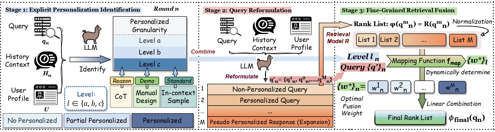
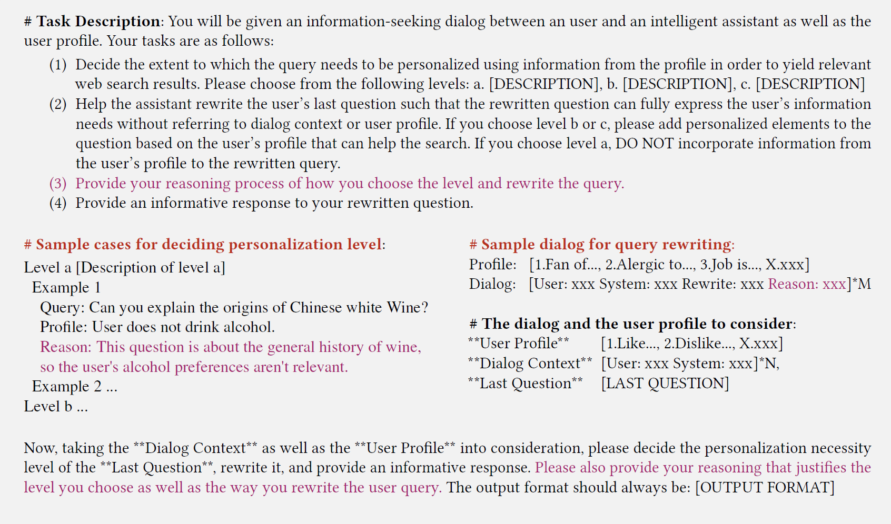
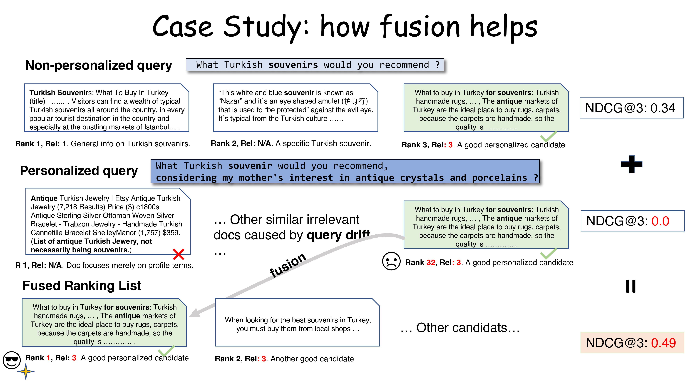

# 🤖Towards Adaptive Personalized Conversational Information Retrieval
<p>
<a href="https://github.com/DaoD/INTERS/blob/main/LICENSE">

</a>
</p> 
This is the repository for our paper "Adaptive Personalized Conversational Information Retrieval" accepted by CIKM 2025. To facilitate follow-up research on Personalized Conversational IR, we release the following resources:

- Our solid codebase for a personalized conversational RAG pipeline, with flexible choices of various retrievers, rerankers, as well as response generators.
- Detailed hands-on guidance of index building, environment setup for dense, sparse and splade retrieval, as well as necessary data preprocessing for TREC iKAT 2023 & 2024 datasets.
- All our prompts ([image illustration](./figures/apcir_prompt.png) and [full text](./src/apcir/rewrite/judge_and_rewrite_prompt_example.txt)), [few-shot examples](./src/apcir/rewrite/personalization_level_examples.txt) for personalization level judgement, and manually curated [Chain-of-Thought reasoning](./data/topics/ikat24/demonstration_using_ikat24_level.json) for query reformulation
- Case study on 
  1. some [examples](./src/apcir/rewrite/query_reformulations_examples.txt) of query reformulation & pseudo-responses for each personalization level.
  2. An [example](#-case-study-the-power-of-fusion) showing the effectiveness of fusion in terms of personalization.
- 🆕 **Extensions beyond the paper (this branch):** Qwen3-Embedding dense retrieval and ConvDR fine-tuned encoders, conversational *no-rewrite* query types, TREC iKAT 2025 (offline) data, and a shared-corpus *"stream once, fan out"* evaluation path. See [🆕 Extensions beyond the paper](#-extensions-beyond-the-paper).

Let us get started!
## 📑 Table of Contents

- [🆕 Extensions beyond the paper](#-extensions-beyond-the-paper)
- [📖 Illustration of the prompt](#-illustration-of-the-prompt)
- [📖 Case study: the power of fusion](#-case-study-the-power-of-fusion)
- [📚 Environment Setup & Index Building](#-environment-setup--index-building)
  - [Conda Python Environment](#conda-python-environment)
  - [Index Building](#index-building)
    - [1. Sparse index building](#1-sparse-index-building)
    - [2. Dense index building](#2-dense-index-building)
    - [3. Splade indexing](#3-splade-indexing)
- [📝 Download TREC iKAT topics and relevance judgement](#-download-trec-ikat-topics-and-relevance-judgement)
  - [Topics file preprocessing](#topics-file-preprocessing)
  - [Qrels file preprocessing](#qrels-file-preprocessing)
- [✍ Query Rewrite](#-query-rewrite)
  - [Prompts](#prompts)
  - [Conversational query types (dense, no LLM rewrite)](#conversational-query-types-dense-no-llm-rewrite)
- [🚀 Running the evaluation Pipeline](#-running-the-evaluation-pipeline)
  - [How to modify the yaml file](#how-to-modify-the-yaml-file)
  - [Evaluation Parameters](#evaluation-parameters)
    - [1. General parameters](#1-general-parameters)
    - [2. Retrieval parameters](#2-retrieval-parameters)
    - [3. Fusion parameters](#3-fusion-parameters)
    - [4. Reranking parameters](#4-reranking-parameters)
    - [5. Response Generation parameters](#5-response-generation-parameters)
    - [6. Metrics parameters](#6-metrics-parameters)
    - [7. iKAT Project Specific parameters](#7-ikat-project-specific-parameters)
- [🔁 Reranking with a multi-GPU server pool](#-reranking-with-a-multi-gpu-server-pool)
- [💬 iKAT'26 Interactive Submission (Sim.API)](#-ikat26-interactive-submission-simapi)
- [🔎 Magpie — interactive search web app](#-magpie--interactive-search-web-app)
- [⚡ Shared-Corpus Evaluation (stream once, fan out)](#-shared-corpus-evaluation-stream-once-fan-out)
- [📄 Citation](#citation)
- [🙏 Acknowledgement](#acknowledgement)


## 🆕 Extensions beyond the paper

Since the CIKM 2025 camera-ready, this branch grew the codebase into a general bench for **(personalized) conversational dense retrieval**. Everything below plugs into the same config-driven pipeline described in the rest of this README; nothing in the paper's workflow changes.

| Extension | What it adds | Where |
| --- | --- | --- |
| **Qwen3-Embedding retrieval** | `qwen3` (`Qwen3-Embedding-0.6B`, last-token pooling + L2, dim 1024) as a first-class dense retriever. | [Retrieval parameters](#2-retrieval-parameters) |
| **ConvDR fine-tuned encoders** | `conv-qwen3` / `conv-ance`: the *query* encoder is fine-tuned, the *doc* encoder is **frozen**, so the base ClueWeb22-B index is reused unchanged. | [Retrieval parameters](#2-retrieval-parameters) |
| **Conversational query types** | Feed the whole dialogue to a dense encoder with no LLM rewrite: `full_conversation`, `qwen_conversation` (+ PTKB / prev-conv variants), `oracle_qwen_instruct`. | [Conversational query types](#conversational-query-types-dense-no-llm-rewrite) |
| **TREC iKAT 2025 (offline)** | 2025 passage-ranking topics + NIST qrels, preprocessed into the same internal schema as 23/24. | [`IKAT_2025_DATA_REPORT.md`](docs/IKAT_2025_DATA_REPORT.md) |
| **Shared-corpus evaluation** | Search the ~478 GB ClueWeb index **once** for a batch of experiments that share a doc index, instead of re-streaming it per experiment. | [Shared-Corpus Evaluation](#-shared-corpus-evaluation-stream-once-fan-out) |

> **Codebase layout.** The source is organized as the `apcir` Python package under [`src/apcir/`](src/apcir/): `evaluate/` (pipeline entry + arg/parsing), `functional/` (the `Turn` object & query building in `topics.py`, prompts in `promptor.py`), `search/` (retrieval/fusion/rerank, with the shared-corpus loop in `search/grouped/`), `indexing/` (`dense/`, `splade/`, sparse), and `rewrite/` (LLM query reformulation). Run entry points as modules **from `src/`**, e.g. `python -m apcir.evaluate.run_experiments --config <yaml>`.


## 📖 Illustration of the prompt
The figure below illustrates our prompt design. Sentences highlighted in purple represent instructional components intended to encourage the reasoning capabilities of large language models (LLMs). In our implementation, these instructions can be optionally included or excluded. Effectiveness of these instructions in terms of personalization level judgement and query reformulation is confirmed by the ablation study part of our paper.




## 📖 Case study: the power of fusion 


This example shows how fusing a personalized query with its non-personalized counterpart can help overcome the query drift issue caused by noisy terms in a personalized query. 

In contrast with outstanding performance achieved by LLMs in Conversational Query Reformulation, formulating personalized queries by relying on LLMs to select and incorporate relevant pieces from the user profile can sometimes lead to poor search queries. 

This is because user profile terms are inherently noisier than those extracted from conversation history. Terms added by LLMs in CQR typically address missing pieces in a conversational query caused by coreference and ellipsis. They are key components that contribute to the majority of the query’s semantic meaning and qre crucial to make the user’s primary search intent understandable. On the other hand, terms from user profiles are usually only weakly semantically related to the query. Although these profile terms may hint at the user’s preferences and potentially complement the search intent, explicitly expanding them into the reformulated queries might result in query drift issue, i.e., retrieving irrelevant documents that focus solely on these terms. This creates a dilemma: excluding profile terms risks omitting valuable personalized context, whereas introducing an excessive number of these pieces risks drifting from the original query and hinders search performance. This is a challenge we denote as over-personalization.

To be more concrete, let us consider the personalized query in the above figure: 

> What Turkish souvenir would you recommend, considering **my mother's interest in antique crystals and porcelains?** 

In this query, the phrase "**collection
of antique crystals and porcelains**" is extracted from the user profile by an LLM (GPT-4o). While it indeed enriches the user’s search intent by implying a preference for fine art pieces as souvenirs, it also introduces potential noise. Specifically, a BM25 search using the personalized query may prioritize documents that mention these terms superficially, such as those discussing Turkish jewelries that are not souvenirs. For instance, as shown in the second row of the figure, the top-ranked document by BM25 simply lists types of Turkish jewelry, with no indication of whether they are good souvenir candidates or how a tourist might obtain them. In contrast, a truly relevant document that thoroughly discusses how to select and purchase high-quality antique Turkish souvenirs is buried at rank 32. This leads to a **zero** NDCG@3 score for the personalized query.

The goal, then, is to surface such high-quality, contextually appropriate documents to the top of the ranking list. To achieve this, we seek distinguishing characteristics of these highly relevant documents that can separate them from those that merely include noisy personalized terms. We notice that truly relevant documents also tend to rank relatively well when using a non-personalized version of the query. This is illustrated in the first row of the figure, where the same ideal candidate is ranked 3rd by BM25 when searching with:

> What Turkish souvenir would you recommend?

This property can be exploited to improve ranking. Our approach fuses the results from the personalized and non-personalized queries. Specifically, we compute a final relevance score for each document by averaging its scores from both ranking lists. In this Turkish souvenir example, the fusion successfully elevates the ideal personalized candidate to the top of the final ranking.

 The effectiveness of the fusion can also be highlighted with the final NDCG@3 score of 0.49. Note that the original personalized query yields a zero NDCG@3 score, while the non-personalized query only yields  NDCG@3 score of 0.33. Therefore The fusion mechanism counter-intuitively benefit from a 0-score NDCG@3 ranking list of very poor quality to bring a significant improvement of 0.49 - 0.33 = 0.16 in terms of NDCG@3, which is a 48% relative improvement over the non-personalized query. This showcases that, if judiciously leveraged, personalized information can meaningfully enhance retrieval quality. Moreover, it underscores ranking list fusion as an effective strategy for integrating personalization in search.


## 📚 Environment Setup & Index Building 
### Conda Python Environment
Please follow the steps below to create a conda environment with all the necessary packages.

[Option 1] Use the provided environment.yml file
```bash
# Create a new conda environment
conda env create -n <your desired env name> -f environment.yml
```
[Option 2] Manually install the packages
```bash
# Create a new conda environment
conda create -p <the_folder_where_you_store_the_environment> python=3.12
conda activate <the_folder_where_you_store_the_environment>
# Install torch
conda install pytorch torchvision torchaudio pytorch-cuda=12.1 -c pytorch -c nvidia
# FAISS for dense retrieval
conda install -c conda-forge faiss-gpu
# For rankGPT:
conda install -c laura-dietz cbor=1.0.0
# Install other packages with pip
pip install -r requirements.txt
pip install flash-attn --no-build-isolation
# Finally, install this repo as an editable package ("apcir").
# This registers the package so `import apcir...` works from any directory (no more
# sys.path hacks / "must cd to src"); --no-deps because the deps are already installed above.
pip install -e . --no-deps
```

> **Package layout.** The source lives as the `apcir` package under `src/apcir/`. Shared code is
> consolidated into single homes: `apcir/utils.py` (general utilities + dataloaders),
> `apcir/splade_index.py` (SPLADE inverted index + sparse retrieval), `apcir/models/`
> (dense/SPLADE architectures + `load_model`), and `apcir/functional/encoders.py` (BEIR
> encoders). After `pip install -e .` you also get the `apcir-run` and `apcir-run-grouped`
> console commands (equivalent to `python -m apcir.evaluate.run_experiments[_grouped]`).

### Index Building

#### 1. Sparse index building
For index building, one should first download the collection following the [instructions](https://www.trecikat.com/data/#how-do-i-access-these-resources) provided by TREC iKAT organizers. Due to license issues, we cannot provide the collection directly. After downloading the collection (in `.jsonl` format), one can build lucene index using this script
`src/apcir/indexing/ikat_23_jsonl_sparse_indexing.sh` 

#### 2. Dense index building
First, download the collection as mentioned above. We should then transform the `.jsonl` file to `.tsv` format using `data_preprocessing_scripts/jsonl_to_tsv.py`. Finally, run the multi GPU dense index building script as follows:

```bash
cd src/apcir/indexing/dense
torchrun --nproc_per_node 4 distributed_dense_index.py \
  --local-rank -1 \
  --n_gpu 4 \
  --model_type ance \   
  --collection_path <your tsv file path> \
  --pretrained_doc_encoder_path <Huggingface_repo_local_path> \
  --output_index_dir_path <output index path> \
  --seed 42 \
  --per_gpu_index_batch_size 700 \
  --num_docs_per_block 10000000 \
  --max_doc_length 256
```
Here you should modify the batch size according to your GPU memory. On the other hand, due to RAM restriction, we cannot load all embeddings for the whole collection into memory in one go. The program will therefore encode `num_docs_per_block` at a time then save it to the disk before continuing with the next. We call this an "embedding block" of the whole collection. For instance, if we set `num_docs_per_block` to 10M, then since ClueWeb22B has 116M documents, the program will yield 116M//10M + 1 = 12 embedding blocks. Please review the annotated code for more details.

> **Qwen3-Embedding documents.** Pass `--model_type qwen-embedding` to encode the collection with `Qwen3-Embedding-0.6B` (last-token pooling + L2, dim **1024**); `--model_type ance` keeps the original ANCE (dim **768**). The `conv-qwen3` / `conv-ance` retrievers fine-tune only the *query* encoder and keep the doc encoder **frozen**, so **no new document index is needed** — they reuse the base Qwen3 / ANCE index. See [`CLUEWEB_QWEN_INDEXING_REPORT.md`](docs/CLUEWEB_QWEN_INDEXING_REPORT.md) for the full Qwen encoding recipe.

> **Merging per-rank blocks (required before search).** Multi-GPU encoding writes per-rank shards `doc_emb_block.rank_{r}.{b}.pb`, but the searcher reads consecutively numbered `doc_emb_block.{id}.pb`. Merge them once (run from `src/`):
> ```bash
> python -m apcir.indexing.dense.merge_clueweb_index \
>   --input  <per-rank index dir> \
>   --output <merged index dir> \
>   --expected <total #docs>          # asserts #docs is a clean multiple of the block size
> ```
> Choose the block size from your RAM budget — exactly one block must fit in memory during search.

#### 3. Splade indexing
First, download the collection as mentioned above. We should then change the `.jsonl` file to `.tsv` format using `data_preprocessing_scripts/jsonl_to_tsv.py`. Finally, run the single GPU Splade index building script as follows:
```bash
cd src/apcir/indexing/splade
python index.py \
  --collection_path <your tsv file path> \
  --pretrained_doc_encoder_path <Huggingface_repo_local_path> \
  --output_index_dir_path <output index path> \
  --seed 42 \
  --per_gpu_index_batch_size 190 \
  --max_doc_length 256
```
You should modify the batch size according to your GPU memory.

## 📝 Download TREC iKAT topics and relevance judgement

The next step is downloading the official TREC iKAT topics and relevance judgement (qrel files) from the [iKAT track official website](https://github.com/irlabamsterdam/iKAT/tree/main) and [TREC website](https://trec.nist.gov/data/ikat2023.html),  then proceeding to preprocess them. 

### Topics file preprocessing 
In our pipeline, we use the `Turn` object as the internal representation of each conversation turn (see `src/apcir/functional/topics.py`), so the preprocessing step involves reading the official iKAT topic file, flattening all the conversations to turn level, then converting each turn to a `Turn` object. Specifically, suppose that the downloaded topic file is stored at `./data/topics/2023_ikat_test_topics.json` (also apply for iKAT 24), then use the following code to preprocess trec topics. This would generate all `Turn` objects and transcript them to a `json` file. Note that the resulting `ikat_2023_test.json` file will be used as the input for the evaluation pipeline.
```python
import sys
sys.path.append('./src/')
from apcir.functional.topics import (
    load_turns_from_ikat_topic_files, 
    save_turns_to_json, 
    )
import json

# downloaded from ikat website, in ikat format
ikat_topic_file = "./data/topics/2023_ikat_test_topics.json"
where_to_save = "./data/topics/ikat_2023_test.json"
list_of_turns = load_turns_from_ikat_topic_files(ikat_topic_file)
turn_dict_list = save_turns_to_json(list_of_turns, where_to_save)
print(json.dumps(turn_dict_list[0], indent=4))
```
the corresponding output should look like:
<details>
  <summary> 🖱️ Click to unfold</summary>
  <p>

```json
{
    "turn_id": "9-1-1",
    "conversation_id": "9-1",
    "title": "Finding a diet",
    "current_utterance": "Can you help me find a diet for myself?",
    "current_response": "Sure, these diets fit your condition and preference: 1) Vegan Mediterranean combines the principles of the Mediterranean diet with veganism and emphasizes whole grains, vegetables, beans, nuts, seeds, herbs, and spices. It excludes animal foods while incorporating plant-based alternatives, offering a sustainable and compassionate approach. (2) Vegan Keto: is a high-fat, low-carbohydrate, and moderate-protein diet which is also exclusively plant-based. It suits individuals following a vegan lifestyle who wish to adopt a ketogenic eating plan. (3) Eco-Atkins is a vegetarian variation of the Atkins diet which focuses on whole grains, vegetables, tofu, legumes, nuts, and seeds while minimizing animal products. By reducing carbohydrate intake and incorporating plant-based protein sources, it promotes sustainability and healthier eating. (4) The Ornish Diet (with limited exercise) is designed to improve overall health, support weight loss, and reverse cardiovascular disease progression, the Ornish diet is low in fat. It emphasizes exercise, stress management, and healthy relationships alongside a low-fat eating plan. It is worth noting that vegan diets, in general, have been linked to a lower risk of chronic health conditions, including heart disease. These diet options provide alternatives for individuals with specific dietary preferences and goals.",
    "oracle_utterance": "Can you help me find a diet for myself considering that I'm vegetarian, allergic to soybeans, lactose intolerant, can't exercise too much, and should drink water regularly?",
    "response_provenance": [
        "clueweb22-en0035-25-01897:1",
        "clueweb22-en0004-30-08099:2",
        "clueweb22-en0038-84-16253:4",
        "clueweb22-en0020-69-12751:1",
        "clueweb22-en0007-46-12888:5"
    ],
    "context_utterances": [],
    "ptkb": {
        "1": "I don't like the new spin-off; because I keep comparing the two and it has lower quality.",
        "2": "Because of my kidney problem, I have to drink water frequently to stay hydrated.",
        "3": "I'm going to change my phone.",
        "4": "I can't exercise too much because of the heart problem that I have.",
        "5": "I'm vegetarian.",
        "6": "I'm lactose intolerant.",
        "7": "I'm allergic to soybeans.",
        "8": "I just finished watching the Game of Thrones.",
        "9": "I didn't like how the series ended, especially the war scenes.",
        "10": "I'm an Android user."
    },
    "ptkb_provenance": [
        5,
        4,
        2
    ],
    "reformulations": [],
    "results": []
}
```
  </p>
</details>

> **iKAT 2025 (offline / passage ranking).** The 2025 offline topics rename a few fields (`turns`→`responses`, `utterance`→`user_utterance`, `ptkb` dict→array, …). They are handled by [`data_preprocessing_scripts/preprocess_ikat25.py`](data_preprocessing_scripts/preprocess_ikat25.py), which emits the **same internal schema** shown above. See [`IKAT_2025_DATA_REPORT.md`](docs/IKAT_2025_DATA_REPORT.md) for the full field-difference table and the offline-vs-interactive track discussion.

### Qrels file preprocessing 
We use `data_preprocessing_scripts/preprocess_qrel.py` to preprocess qrel file downloaded from ikat website. This just replaces _ with - for unifying iKAT 23, 24 and 25 qrel files. 
## ✍ Query Rewrite
Once the topics have been processed, we are ready for getting query reformulations. Please view files in `src/apcir/rewrite` to run query rewriting. Specifically, you can run
```bash
cd ./src/apcir/rewrite
./rewrite_ikat_23.sh # or ./rewrite_ikat_24.sh
```
to rewrite queries for TREC iKAT 2023 or 2024 respectively. The program will first read the `json` file for loading `Turn` objects to memory, then put the rewritten queries to each `Turn` object then retranscripted them back to a `json` file. You should carefully review the code to understand the rewriting process and determine which  `reformulation_name` and `rewrite_model` to specify in the script. Here is a brief summary of available reformulation names:
- `gpt-4o_judge_and_rewrite`: The personalized reformulation method used in the paper, which first dynamically decides the personalization need for each query then rewrite and response accordingly.
- `gpt-4o_rar`: The non-personalized query reformulation method used in the paper. Will get a de-contextualized query and pseudo-response.
- ... and so on. Please review the code for more details.

### Prompts
An example of the prompt used in the paper is available at `src/apcir/rewrite/judge_and_rewrite_prompt_example.txt` (prompt construction lives in `src/apcir/functional/promptor.py`). The corresponding few-shot CoT examples are available at `data/topics/ikat23/demonstration_using_ikat23_level.json` and `data/topics/ikat24/demonstration_using_ikat24_level.json`

### Conversational query types (dense, no LLM rewrite)

The reformulations above are **pre-computed** LLM rewrites stored back into each `Turn`. The pipeline also supports query types that are **built at retrieval time** from the raw `Turn` (in `Turn.query_type_2_query()`, see [`src/apcir/functional/topics.py`](src/apcir/functional/topics.py)) and fed *directly* to a dense encoder — no rewrite step, no API calls. These were added for (personalized) conversational dense retrieval and are selected, like any other rewrite, via `--retrieval_query_type`:

| `retrieval_query_type` | Builds | Intended encoder |
| --- | --- | --- |
| `full_conversation` | Interleaved `[q1, r1, …, q_cur]` (user utterances + system responses). A **logical** value resolved at runtime to `full_conversation_sparse` (BM25, `[SEP]`-joined) or `full_conversation_dense` (ConvDR token build: per-turn 64/64 caps, 512 total). | `ance` / `conv-ance` |
| `qwen_conversation` | Qwen instruction + interleaved `User:` / `System:` turns, ending in `User's last question:`. | `qwen3` / `conv-qwen3` |
| `qwen_conversation_ptkb` | `qwen_conversation` + the full numbered **user profile** (PTKB), placed *before* the conversation. | `qwen3` / `conv-qwen3` |
| `qwen_conversation_ptkb_previous_conv_as_ptkb` | The above + the same persona's **previous conversation** prepended (iKAT-25 only). | `qwen3` / `conv-qwen3` |
| `oracle_qwen_instruct` | The human `oracle` rewrite wrapped in the MSMARCO Qwen instruction (`Instruct: Given a web search query, retrieve relevant passages…`). | `qwen3` only |

> A dense query rewrite is only meaningful if the query is encoded the *same way* as the documents in its index — same pooling (last-token for Qwen, ANCE's native pooling) and L2 normalization. The `qwen_*` options apply the instruction to the **query side only**, never to the documents.


## 🚀 Running the evaluation Pipeline
Before running the pipeline, please make sure that you have built the indexes, downloaded relevance judgements, and got query reformulations as mentioned above. Then, you should specify all the required evaluation parameters in a `fuse_then_eval` config (e.g. `src/apcir/evaluate/fuse_then_eval_config_23.yaml`), then run it as a module from `src/`:
```bash
cd ./src
python -m apcir.evaluate.run_experiments --config ./apcir/evaluate/fuse_then_eval_config_23.yaml
```
this will yield the evaluation metrics for our methods in the "Aligned Comparison" part of the paper (w/. reranker). 


### How to modify the yaml file
The yaml file has 3 main zones, as shown in the following example. Here is a brief summary of each zone:
- `"iterate"`: This zone is where you define the combination of experiments to run. For instance, in the example below, we are running experiments on 3 retrieval models, 2 topics (two datasets), and 2 rerankers on the human rewrite then generate an answer using gpt-4o, which results in 3x2x2=12 experiments. The program `run_experiments.py` will iterate over all the combinations of these parameters and run the experiments (sequentially). 
- `"param_mapping"`: This zone is where you define some fixed relationships between the parameters. For instance, if you specify that you want to run experiments for iKAT 23 dataset in the first zone, then the path for both input query and qrels file should be those for iKAT23. In the following example, we define such a mapping between values of "topics" and values of "input_query_path" and "qrel_file_path". 
- `"fixed"`: This zone is where you define all other parameters that should remain unchanged for all the experiments defined in the first zone. For the full parameter list, please refer to the annotated code in `src/apcir/evaluate/evaluation.py`. We will also explain each of these parameters in the following section. Basically, the parameter values defined by the first zone and the second zone will overwrite the values defined in this zone. For the details about this mechanism, please refer to the annotated code in `src/apcir/evaluate/run_experiments.py`.
```yaml

###############################################################
##### First zone: Define the combination of experiments to run
###############################################################
iterate:
  topics: ["ikat_23_test", "ikat_24_test"]
  retrieval_model: ["BM25", "ance", "splade_v3"]
  retrieval_query_type: ["oracle"]
  reranking_query_type: ["oracle"]
  reranker : ["monot5_base_10k","rankllama"]
  generation_model: ['gpt-4o-2024-08-06']

###############################################################
##### Second zone: define some fixed relationships between the parameters
###############################################################
param_mapping:
  topics:
    ikat_24_test:
      input_query_path: "../data/topics/ikat24/ikat_2024_test.json"
      qrel_file_path: "../data/qrels/ikat_24_qrel.txt"             # not available for non-participants
    ikat_23_test:
      input_query_path: "../data/topics/ikat23/ikat_2023_test.json"
      qrel_file_path: "../data/qrels/ikat_23_qrel.txt"
  machine: ..................

###############################################################
##### Third zone: All other parameters that should remaining unchanged for all the exmperiments defined in the first zone.
###############################################################
fixed:
  collection: "ClueWeb_ikat"  # Dataset collection
  topics: "ikat_23_test"  # Test topics
  input_query_path: "../data/topics/ikat23/ikat_2023_test.json"  # Path to input query file
  sparse_index_dir_path: "/part/01/Tmp/yuchen/indexes/clueweb22b_ikat23_official_sparse_index/"  # Use local disk index for fastest access
  output_dir_path: "../results"  # Path to save results
  qrel_file_path: "../data/qrels/ikat_23_qrel.txt"  # Qrel file path
  seed: 42  # Random seed for reproducibility

  # rertrieval parameters ......................
  # reranking parameters ......................
  # response generation parameters ......................
  # Fusion parameters ......................
```
### Evaluation Parameters
Now we will explain all the parameters that you can specify in the yaml file. Please refer to the annotated code in `src/apcir/evaluate/evaluation.py` for further details. The behavior of the file  `evaluation.py` is as follows:
1. get all information about this run and generate an identifiable name for this run, e.g. name = "S1[raw]-S2[none]-g[raw]-[BM25]-[monot5_base_10k_4_1_none]-[s2_top50]", this means use BM25 to search with raw utterance, then use monot5_base_10k to rerank with raw utterance on top50 docs, then use raw utterance to generate response. 4_1_ refers to rankGPT window size and step size, and since we do not use rankGPT here, that is not relevant.
2. initialize a wandb run if `save_to_wandb` is true
3. if `run_rag` = false, try to load the ranking list from `output_dir_path`/`collection`/`topics`/ranking/name.txt, if not found, raise an error 
4. if `run_rag` = true, continue with search:
5. search: if `retrieval_model` = "none", load the ranking list from `given_ranking_list_path`, if not found, raise an error 
5. search: if `fusion_type` is not "none", do retrieval + fusion, using `QRs_to_rank`
6. search: if no fusion, do retrieval.
7. search: rerank based on the result of 6 or 7
12. search: save the ranking list if `save_ranking_list` is true
8. generate response
9. if `run_eval` = true, evaluate the results
11. save the results to `Turn` object if `save_results_to_object` is true
10. save the evaluation metrics to wandb if `save_to_wandb` is true
12. save the evaluation metrics to output_dir_path/collection/topics/metrics/name.json


Now let us continue with all the parameters~
#### 1. General parameters
-   `collection`: The name of the collection. This is used to generate an identifiable name for each run and to determine where to save the evaluation results. (e.g., "ClueWeb_ikat")
-   `topics`: The name of the dataset. This is used to generate an identifiable name for each run and to determine where to save the evaluation results. (e.g., "ikat_23_test")
-   `input_query_path`: Path to the input query file. (e.g., "../data/topics/ikat23/ikat_2023_test.json")
-   `sparse_index_dir_path`: Path to the sparse index directory. Use a local disk index for the fastest access. 
-   `output_dir_path`: Path to save the results. Default to "../results", then the results will be saved to "../results/[collection]/[topics]/". 
-   `qrel_file_path`: Path to the qrel file. (e.g., "../data/qrels/ikat_23_qrel.txt")
-   `seed`: Random seed for reproducibility. (e.g., 42)
-   `save_results_to_object`: Whether to save results to a `Turn` object. (e.g., true)
-   `save_ranking_list`: Whether to save the ranking list to a file located at "../results/[collection]/[topics]/ranking". (e.g., true)
-   `run_rag`: Whether to run the Retrieval-Augmented Generation pipeline. (e.g., true). 
-   `run_eval`: Whether to run the evaluation. (e.g., true) Set to false if you just want to get something to submit to TREC. 

#### 2. Retrieval parameters

-   `retrieval_model`: The retrieval model to use. Can be "none", "BM25", "ance", "dpr", "splade_v3", "repllama", "qwen3", "conv-qwen3", "conv-ance". If "none", read the ranking list from `given_ranking_list_path`. The dense options `qwen3` (Qwen3-Embedding-0.6B, dim 1024) and the ConvDR fine-tunes `conv-qwen3` / `conv-ance` are extensions beyond the paper (see [Extensions](#-extensions-beyond-the-paper)); because the fine-tunes register as their own model names, their result files never collide with the base-model runs.
-   `retrieval_top_k`: The number of documents to retrieve. (e.g., 1000)
-   `personalization_group`: The personalization group to use. Can be "a", "b", "c", "all". You should always use "all" for the experiments in this paper.
-   `query_gpu_id`: The GPU ID for dense/splade query encoder. (e.g., 2)
-   `query_encoder_batch_size`: The batch size for query encoding. (e.g., 200)

##### Splade parameters

-   `splade_query_encoder_path`: Path to the Splade query encoder. 
-   `splade_index_dir_path`: Path to the Splade index. 

##### Dense parameters

-   `use_pyserini_dense_search`: Whether to use Pyserini's dense search. (e.g., false) Please set to false for this paper.
-   `dense_query_encoder_path`: Path to the dense query encoder. 
-   `dense_index_dir_path`: Path to the dense index. 
-   `faiss_n_gpu`: Number of GPUs for FAISS. (e.g., 4)
-   `use_gpu_for_faiss`: Whether to use GPU for FAISS. (e.g., true)
-   `embed_dim`: Embedding dimension. (e.g., 768) Must match the index: 768 for ANCE, **1024 for Qwen3**.
-   `tempmem`: Temporary memory setting. (e.g., -1)
-   `passage_block_num`: Number of passage blocks. (e.g., 12)

##### BM25 parameters

-   `bm25_k1`: BM25 k1 parameter. (e.g., 0.9)
-   `bm25_b`: BM25 b parameter. (e.g., 0.4)

##### Query Expansion (QE) parameters

-   `qe_type`: The type of query expansion to use. (e.g., "none")
-   `fb_terms`: Number of feedback terms. (e.g., 20)
-   `fb_docs`: Number of feedback documents. (e.g., 10)
-   `original_query_weight`: Weight of the original query. (e.g., 0.5)

#### 3. Fusion parameters

-   `fusion_type`: The type of fusion to use. Can be 'none', 'round_robin', 'linear_combination', 'linear_weighted_score', 'per_query_personalize_level'. 
-   `QRs_to_rank`: The list of QRs to fuse. (e.g., ["mistral_rar_rw", "mistral_rar_rwrs", "mistral_judge_and_rewrite_rw"])
-   `fuse_weights`: Weights for linear combination fusion. (e.g., [0.1, 0.4])
-   `fusion_normalization`: Normalization method for fusion. Can be "none", "max", "min-max". 
-   `level_type`: The type of personalization level. Can be 'per_query_personalize_level', "gpt-4o_judge_and_rewrite"(used by this paper), "gpt-3.5_judge_and_rewrite". 
-   `per_query_weight_max_value`: Maximum weight for per-query optimization. (e.g., 1.2) Not relevant to this paper.
-   `optimize_level_weights`: Strategy for optimizing level weights. Can be "no level", "2+1", "group".  Please use "group" for the main method of this paper. "no level" means find the best weight without considering levels, 2+1 means first determine the weights for the first two QR, then determine the weight for the third QR. "group" means per-level optimization as described in the paper.
-   `target_metrics`: Metrics to optimize using grid search. (e.g., "mrr,ndcg@3,recall@10,recall@100")
-   `optimize_step`: Grid search step size. (e.g., 0.01)

#### 4. Reranking parameters

-   `reranker`: The reranker to use. Can be "none", "rankllama", "rankgpt", "monot5_base", "monot5_base_10k", "monot5_large", "monot5_large_10k", "monot5_3b", "monot5_3b_10k". 
-   `rerank_top_k`: The number of top documents to rerank. (e.g., 50)
-   `cache_dir`: Cache directory for Hugging Face models. 
-   `rerank_batch_size`: Batch size for reranking. (e.g., 67)
-   `rerank_quant`: Quantization level for reranking. Can be "none", "8b", "4b". 
-   `rankgpt_llm`: LLM to use for rankGPT. (e.g., "gpt-3.5-turbo")
-   `window_size`: Window size for rankGPT. (e.g., 4)
-   `step`: Step size for rankGPT. (e.g., 1)

#### 5. Response Generation parameters

-   `generation_model`: The model to use for response generation. (e.g., "gpt-4o-2024-08-06")
-   `generation_prompt`: The prompt to use for response generation. Can be "none", "raw"
-   `generation_top_k`: The number of documents to use for response generation. (e.g., 3)

#### 6. Metrics parameters

-   `save_to_wandb`: Whether to save the results to Weights & Biases. (e.g., true)
-   `metrics`: The metrics to compute. (e.g., "map,ndcg,ndcg_cut.1,ndcg_cut.3,ndcg_cut.5,ndcg_cut.10,P.1,P.3,P.5,P.10,P.20,recall.5,recall.10,recall.20,recall.50,recall.100,recall.1000,recip_rank")
-   `metrics_to_print`: The metrics to print to the console. (e.g., ["recip_rank", "ndcg_cut_3", "recall_10", "recall_100"])
-   `given_ranking_list_path`: Path to a given ranking list for evaluation. (e.g., "/results/ClueWeb_ikat/ikat_24_test/ranking/S1[gpt-4o_rar_rw_fuse_rar_rwrs_fuse_non_personalized_cot1_rw]-S2[gpt-4o_rar_personalized_cot1_rw]-g[gpt-4o_rar_personalized_cot1_rw]-[none]-[monot5_base_10k_4_1_none]-[s2_top50].txt")

#### 7. iKAT Project Specific parameters

-   `run_name`: A name for the run (for iKAT submission). (e.g., "none")
-   `retrieval_query_type`: The type of query used for retrieval. (See evaluation.py for all possible values, including the conversational dense types above)
-   `reranking_query_type`: The type of query used for reranking. (See evaluation.py for all possible values)
-   `generation_query_type`: The type of query used for generation. (See evaluation.py for all possible values)


## 🔁 Reranking with a multi-GPU server pool

> Extension beyond the paper. Lets one reranker (qwen3 / monot5 / rankllama) serve **all**
> experiments without reloading the model per run, and fan the per-query work across N GPUs.

**Why.** `run_experiments.py` spawns one `evaluation.py` subprocess **per (retriever × dataset ×
reranking-query) combo**. If each subprocess loads the reranker (e.g. the 8 GB Qwen3-Reranker-4B
or 7B RankLLaMA) from disk, a 24-combo sweep pays that load 24× — and a single GPU underuses the
other three. The fix is process-level **data parallelism realized as resident servers**: load the
model **once per GPU**, keep it warm, and let a thread-pool client fan a config's queries across
the servers round-robin.

```
                         eval driver (run_experiments → evaluation.py → search.py → rerank())
                                              │  rerank_remote_url = "url0,url1,url2"
                                              ▼
                                  RemoteRerankerPool  (ThreadPool, round-robin)
                ┌─────────────────────────────┼─────────────────────────────┐
                ▼                              ▼                              ▼
        rerank_server (GPU1)          rerank_server (GPU2)          rerank_server (GPU3)
        model loaded ONCE             model loaded ONCE             model loaded ONCE
        POST /rerank {instr,          (CUDA_VISIBLE_DEVICES=g per server; --reranker_type
         query, docs}→scores           selects qwen3_reranker | monot5_* | rankllama)
```
The **interactive search server uses the same `rerank_server`** — it is just **N = 1** of this.

**How to run (manual, no Claude needed).** From `src/`, in the `trec_ikat` py3.12 env:
```bash
# 1) start one reranker server per GPU (prints RERANK_URLS=...). 3rd arg = reranker type.
bash scripts/start_rerank_servers.sh "1,2,3" 8200 qwen3_reranker      # or monot5_3b / rankllama / ...

# 2) put the printed comma-list into the yaml (or pass --rerank_remote_url):
#    rerank_remote_url: "http://127.0.0.1:8200,http://127.0.0.1:8201,http://127.0.0.1:8202"
#    reranker: ["qwen3_reranker"]      reranking_query_type: ["oracle"]   rerank_top_k: 50
PATH=/data/rech/huiyuche/envs/trec_ikat/bin:$PATH \
  python -m apcir.evaluate.run_experiments --config ./apcir/evaluate/fuse_then_eval_config_<name>.yaml

# 3) stop the servers when done
pkill -f apcir.search.rerank_server
```
Notes: **rerank-only** runs reuse the existing no-rerank rankings via the disk-load shortcut
(`search.py`, matches stem `(retrieval_query_type, retriever, none)`) → no index load, only the
reranker GPUs work. A single URL → `RemoteReranker`; no URL → in-process load. Reranker code:
`apcir/search/rerank.py` (`QwenReranker` / `MonoT5Scorer` / `RankLlamaScorer` + `build_local_reranker`),
server `apcir/search/rerank_server.py`. **One-shot alternative** (no resident servers, one launch
reranks all combos sharded by `accelerate`): `accelerate launch --num_processes K --multi_gpu -m
apcir.search.rerank_accel --config <yaml>` — byte-identical to 1-GPU, but no per-combo checkpoint;
prefer the server pool for sweeps. Reranking numbers carry ~±0.5 GPU-GEMM batch noise.

## 💬 iKAT'26 Interactive Submission (Sim.API)

> Extension beyond the paper — the 2026 track is **interactive only** (no offline run file; the
> Sim.API assembles the run from per-turn payloads). Code in `apcir/interactive/`.

Two long-running processes + a thin driver, deliberately split so the 336 GB index loads once:
```
   ┌────────────────────────── octal40 ──────────────────────────┐         ┌──────────────┐
   │  search_server.py  (FastAPI, 1 worker)        POST /search   │  per    │   Sim.API    │
   │   GPU0,1,2  RAM ANCE index(336G)+GPU faiss+BM25 lucene        │ ◄─turn─ │ (user simul.)│
   │   GPU3      [shared LLM] vLLM Qwen3-32B  (online QR + RAG)    │  call   │  /debug/*    │
   │   GPU3      [optional]  Qwen3-Reranker  (step-2.5 rerank)     │         │  /run/*      │
   └───────────────────────────────▲──────────────────────────────┘         └──────▲───────┘
                                    │ POST /search {utterance,history,ptkb}          │ start/continue
                                    └──────────────  driver.py (run_driver) ─────────┘
```
Per turn: build a `Turn` → **online QR** (`rewriter.py`, any rewrite.py prompt: rar /
MQ4CS_persq / GtR / ptkb_sum …) → retrieve (BM25 + ANCE) → RRF fuse → **[optional rerank]** →
**RAG answer** (`generation.py`, ≤512 tok) + top-10 citations. The shared LLM (`llm_client.py`)
runs on **OpenAI** (`gpt-5-mini`; uses `max_completion_tokens`) **or local vLLM** (`Qwen3-32B-AWQ`
on GPU3). The Sim.API submission body is `{run_id, response, citations, meta}` (PTKB rides in
free-form `meta`); token is read **only** from env `IKAT_SIM_TOKEN`.

**How to run (manual).** From `src/`, env `trec_ikat`:
```bash
# 0) preflight (read-only, no budget): team + remaining budget
IKAT_SIM_TOKEN=<tok> python -m apcir.interactive.run_driver --preflight --mode debug

# 1) start the search server (OpenAI backend = GPUs free for faiss; ~2-3 min to load the index)
python -m apcir.interactive.run_server --port 8000 \
   --retrievers ance --retrieval_query_types full_conversation_dense \
   --qr MQ4CS_persq --generation rag --llm_backend openai --llm_model gpt-5-mini --faiss_n_gpu 3
#   curl localhost:8000/health   # wait for dense_loaded:true

# 2) drive ONE debug conversation (costs 1 of 100 debug sessions)
IKAT_SIM_TOKEN=<tok> python -m apcir.interactive.run_driver --mode debug --max_conversations 1 \
   --server_url http://127.0.0.1:8000 --run_id rali_debug_v1 --description "RALI debug"
```
Records land in `results/ClueWeb_ikat/ikat_26_sim_debug/{ranking,interactive}/`. Official
`--mode run` requires `--i_understand_run_is_scored` (protects the scored runs). See the
`ikat-interactive-submission` skill for the full option matrix + gotchas.

## 🔎 Magpie — interactive search web app

> Extension beyond the paper. The same `apcir/interactive/` engine also powers **Magpie**, a
> log-in web app for personalized conversational search over ClueWeb22-B / QReCC / TopiOCQA:
> pick corpora, retrievers and rerankers at runtime (indexes load/evict on demand,
> capacity-guarded), and get inline-cited RAG answers with a side-by-side retriever comparison
> grid and an auto-learning user profile (PTKB).
>
> - **Backend (this repo)**: [`src/apcir/interactive/README.md`](./src/apcir/interactive/README.md)
>   — architecture, endpoints, corpus memory-footprint table, runbook.
> - **Frontend (separate repo)**: [YuchenHui22314/pica](https://github.com/YuchenHui22314/pica)
>   — React SPA; in production the backend serves its built bundle from one port.

## ⚡ Shared-Corpus Evaluation (stream once, fan out)

> Extension beyond the paper.

For dense retrieval the **corpus is the embedding index**, which for ClueWeb22-B is ~**478 GB** — larger than RAM. The default pipeline runs each experiment as its own process, and each process **re-streams the whole index from disk block-by-block**. When you sweep many query types / reranker settings over the *same* doc index (e.g. `qwen3` + `conv-qwen3` × several query types × 23/24/25, all sharing one Qwen index), you pay that disk read **N times** for nothing — the run is disk-bound.

The `run_experiments_grouped` entry point fixes this with a **"stream once, fan out"** loop:

1. **Group** all experiments by `CorpusKey` (`index_dir`, `embed_dim`, `block_num`) — the *encoder is deliberately not part of the key*, so different query encoders over the same doc index group together.
2. **Phase A** — encode every job's queries (cheap, GPU) and vertically **stack** them into one query matrix `Q`.
3. **Phase B** — stream the corpus **once**: for each block, search *all* stacked queries in a single FAISS call, then merge across blocks.
4. **Phase C** — slice the merged results back per job and write the exact same ranking / metrics files as the default path.

It consumes the **same YAML** as `run_experiments.py` and is fully opt-in — the default path is untouched and remains the reference:
```bash
cd ./src
python -m apcir.evaluate.run_experiments_grouped \
  --config ./apcir/evaluate/fuse_then_eval_config_qwen_conv.yaml \
  --merge compat      # compat = byte-faithful to the default path (validation); topk = fast numpy (production)
```

**Validation.** The grouped path was checked byte-for-byte against the default path (`--merge compat`): for `conv-ance × full_conversation × {iKAT-23, iKAT-25}` the ranking, per-query, and averaged metrics are **bit-identical**; for iKAT-24 the only difference is float32 LSB jitter in FAISS-GPU scores from the larger stacked GEMM (every reported metric Δ = 0; MAP Δ = 3e-6, i.e. unchanged at table precision). So the framework is numerically faithful within GPU floating-point noise. Design and validation notes: [`SHARED_CORPUS_FRAMEWORK_DESIGN.md`](docs/SHARED_CORPUS_FRAMEWORK_DESIGN.md), [`GROUPED_CODE_REVIEW.md`](docs/GROUPED_CODE_REVIEW.md). Code: [`src/apcir/search/grouped/`](src/apcir/search/grouped/) (`spec.py`, `block_source.py`, `runner.py`, `merge.py`).


# Citation
If you find this project useful, please cite our paper: 
```
@inproceedings{10.1145/3746252.3761255,
author = {Mo*, Fengran and Hui*, Yuchen and Tian, Yuxing and Tan, Zhaoxuan and Meng, Chuan and Su, Zhan and Huang, Kaiyu and Nie, Jian-Yun},
title = {Towards Adaptive Personalized Conversational Information Retrieval},
year = {2025},
isbn = {9798400720406},
publisher = {Association for Computing Machinery},
address = {New York, NY, USA},
url = {https://doi.org/10.1145/3746252.3761255},
doi = {10.1145/3746252.3761255},
pages = {2137–2147},
numpages = {11},
keywords = {adaptive personalization, conversational information retrieval, personalized query reformulation},
location = {Seoul, Republic of Korea},
series = {CIKM '25}
}
```

# Acknowledgement
Huge thanks to Prof. Nie for his continuous support and supervision; Thanks [Fabrizio Gotti](https://www.linkedin.com/in/fabrizio-gotti/), [Raouf Bencheraiet](bencherr@iro.umontreal.ca), and [Milan Mao](https://www.linkedin.com/in/milan-mao-6b8824198/) for their invaluable help for the project.
